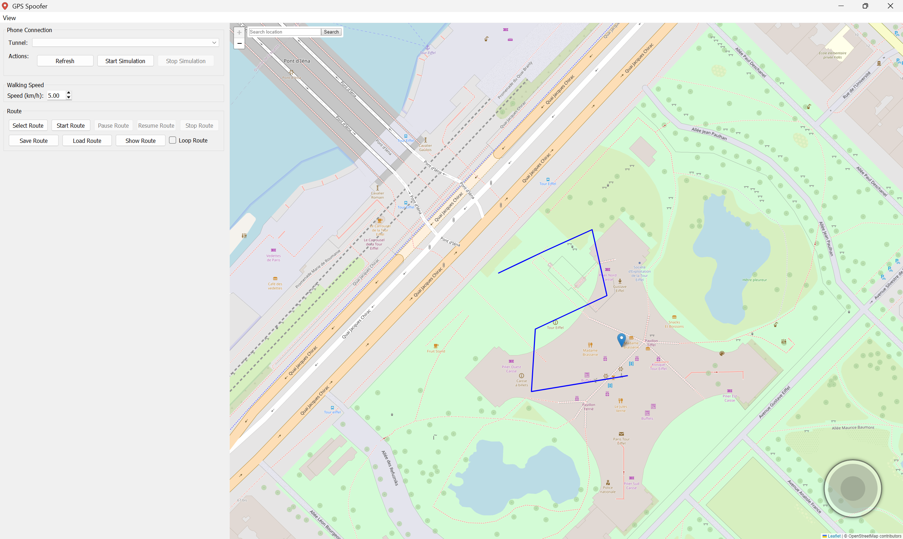
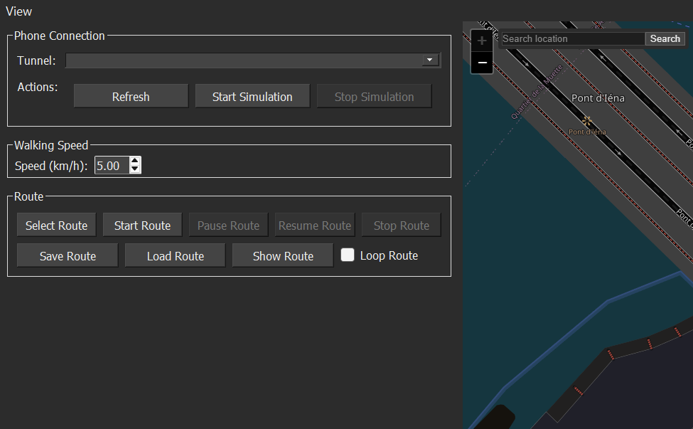

# IOS Spoofer

<p align="center">
  <a href="https://buymeacoffee.com/bjorns98">
    
  </a>
</p>

A desktop GUI for simulating iPhone GPS location through a local tunnel connection, built with **PyQt5**, **Qt WebEngine**, and **pymobiledevice3**.

## Features

- Interactive map-based location control
- Keyboard movement using arrow keys
- Adjustable walking speed
- Route selection directly from the map
- Start, pause, resume, stop, save, and load routes
- Route looping for repeated movement
- Tunnel discovery for connected devices
- Start/stop GPS simulation over the selected tunnel
- Optional dark mode and UI toggles for joystick/search bar visibility

## Requirements

Before running the app, make sure you have:

- Python 3.10+
- Internet connection for loading the map
- An iPhone/iPad supported by `pymobiledevice3`
- A trusted USB connection between the device and your computer
- **Developer Mode enabled on the iPhone**
- The project assets referenced by the UI:
  - `Assets/Map.html`
  - `Assets/Icon.ico`

## Important: Enable Developer Mode on the iPhone

This project relies on development-style device services. On modern iOS versions, the iPhone should be in **Developer Mode** before location simulation works reliably.

### Windows example using 3uTools

1. Install the latest **3uTools** on Windows.
2. Connect the iPhone with a **USB cable** and unlock the device.
3. Trust the computer on the iPhone if prompted.
4. In **3uTools**, open **Toolbox** and go to **Virtual Location**.
5. If this is the first time enabling the required development features, 3uTools may prompt you to turn on **Developer Mode**.
6. The iPhone may reboot automatically.
7. After reboot, confirm **Turn On** on the iPhone when the Developer Mode prompt appears.
8. You can then verify it on the phone under:
   - **Settings -> Privacy & Security -> Developer Mode**

### Notes

- If Developer Mode does not appear, reconnect the device and make sure it has been trusted by the computer.
- Some tools may also require the device to be unlocked while location changes are applied.
- If you previously used other virtual-location tools, their drivers can sometimes interfere.

## Installation

```bash
git clone https://github.com/BjornS98/IOS-Location-spoofer.git
cd IOS-Location-spoofer
python -m venv .venv
source .venv/bin/activate  # On Windows: .venv\Scripts\activate
pip install PyQt5 PyQtWebEngine pymobiledevice3

````

## Screenshots

### Main Window

<p align="center">
  
  
</p>

### Settings

<p align="center">
  
</p>